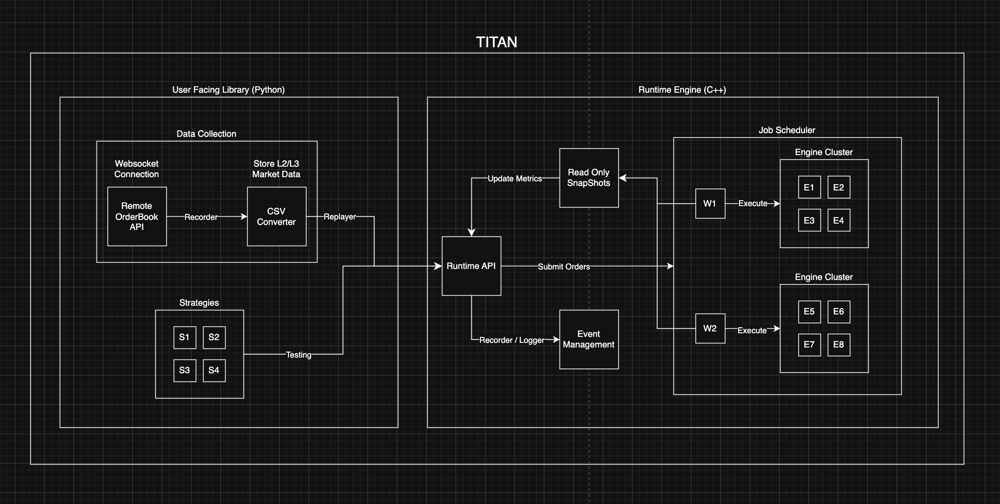

# ⚡ Titan: Multi-Agent Market Microstructure Backtesting Library

Titan is a high‑performance backtesting engine for **algorithmic trading strategies** built on a modern C++20 core with a **Python-first** interface.  
It is designed for realistic **Level‑2 / Level‑3 (order‑by‑order)** market simulations, multi‑agent experiments, and research‑grade performance studies.

**🤔 Why Titan?** For practitioners and researchers in high-frequency trading (crypto or equities), Titan lets you stress-test and evaluate multiple strategies at once across multiple simulated markets—all concurrently—with a single, deterministic run.

---

## 🚀 Key features

- 🤝 **Multi‑agent simulation**: Run many strategies competing in the same order book.
- 📊 **Realistic microstructure**: FIFO price–time priority, ownership validation, and exchange‑style matching.
- ⚡ **High throughput**: C++ core capable of tens to hundreds of millions of orders/sec on a single machine.
- 🐍 **Python strategies**: Write strategies in Python; execution and matching happen in C++ via `pybind11`.
- 📂 **L2 / L3 data replay**: Parse and replay historical feeds (`.bin`, `.csv`, `.csv.gz`) from sources like Tardis.
- 🔁 **Deterministic experiments**: Same data + same code → identical results run‑to‑run.

---

## 🔧 Technical stack

- **C++20** – Core matching engine and runtime (order book, scheduling, snapshots).
- **Highway** – SIMD (SSE4/AVX2/AVX-512, NEON) for hot paths where applicable.
- **pybind11** – Python bindings; strategies in Python, execution in C++.
- **zlib** – Compressed market data (e.g. `.csv.gz`) support.
- **Lock‑free concurrent design** – Per‑worker double‑buffered job queues (atomic swap, no mutex in hot path); order book snapshots use lock‑free caching for fast reads.
- **Memory pooling** – Generational handle pool for orders: O(1) alloc/free, dense storage, no per‑order heap; capacity fixed at engine creation.

---

## 🏗️ Architecture

- **Python layer** – Strategies (callables), `EngineRuntime` singleton, order submission and queries.
- **EngineRuntime** – Multi‑ticker coordinator: job scheduler, worker threads, per‑ticker `OrderEngine` instances, user/order attribution and notifications.
- **OrderEngine** (per instrument) – Price–time priority book, FIFO levels, match‑and‑fill; emits accept/fill/cancel events used for user PnL and volume.



---

## 📁 Repository Layout

- `core/` – C++20 core:
  - `order_engine.cpp` – price–time priority matching engine
  - `engine_runtime.cpp` – multi‑stock runtime, job scheduling, snapshots
  - `test/` – C++ benchmarks and correctness tests; place sample data in `test/examples/`
- `python/titan/` – Python package (C++ bindings via pybind11).
- `python/tests/` – Python tests and utilities:
  - `test_bindings.py`, `test_binance_strategy_throughput.py`, `test_stress_multiworker.py`
  - `download_market_data.py`, `convert_l2_to_csv.py` (Tardis L2 download/convert)
- `docs/` – documentation (installation, quickstart, API).

---

## 🛠️ Installing the Python Library

Titan is a Python package with a C++ extension. Install from source as follows.

**Prerequisites**

- 🐍 **Python** 3.8 or newer  
- ⚙️ **C++20 compiler** (e.g. clang++ on macOS, g++ 10+ or clang++ 11+ on Linux)  
- 📦 **CMake** 3.15+ (optional; only needed if you want to run the C++ test suite)

**System libraries (for the C++ extension)**  
The Python package links against **Highway** (SIMD) and **zlib**. Install them before `pip install .`:

| Platform | Command |
|----------|--------|
| **macOS** (Homebrew) | `brew install highway` *(zlib is usually already present; if not: `brew install zlib`)* |
| **Linux** (Debian/Ubuntu) | `sudo apt install libhighway-dev zlib1g-dev` |
| **Linux** (other) | Install the Highway and zlib development packages for your distro. |
| **Windows** (vcpkg) | `vcpkg install highway` *(and `vcpkg install zlib` if needed; build with [vcpkg](https://vcpkg.io/) toolchain, e.g. set `CMAKE_TOOLCHAIN_FILE`)* |

**Steps**

```bash
# 1. Clone the repository
git clone https://github.com/Donnieboi03/Titan.git
cd Titan

# 2. Install Python dependencies (pybind11, numpy, pandas, etc.)
pip install -r requirements.txt

# 3. Install the Titan package (builds the C++ extension via setuptools)
pip install -e .
```

Step 3 compiles the C++ core and creates the `titan` Python package. No separate CMake build is required to use the library.

**✅ Verify installation**

```bash
python -c "import titan; print(titan.__version__)"
# Expected: 1.0.0
```

**🐳 Docker (alternative)**

If you prefer not to install system libraries (Highway, zlib, compiler) locally, you can build and run Titan in a container. The image includes all build and runtime dependencies.

```bash
# From repo root
docker build -t titan .
docker run -it titan python -c "import titan; print(titan.__version__)"
# Or open a shell to run scripts:
docker run -it titan bash
```

See the [Installation guide](docs/installation.md#docker) for details and options.

**🧪 Run Python tests (optional)**

From the repo root:

```bash
python python/tests/test_bindings.py
```

**🔬 Run C++ tests (optional)**

If you want to run the C++ unit tests as well:

```bash
mkdir -p build && cd build
cmake ..
cmake --build . -j8
ctest
cd ..
```

---

## ⚡ Python Quickstart

```python
import titan

# Initialize runtime (singleton: 8 workers, 4M order capacity)
titan.EngineRuntime.reset_instance()
runtime = titan.EngineRuntime.get_instance(num_threads=8, capacity=4 * 1024 * 1024)

# Register a stock
runtime.register_stock("AAPL", 150.0, 1_000_000.0)

# Submit a limit order
runtime.submit_limit_order("AAPL", "BID", 149.95, 100.0)
runtime.process_pending_orders()

# Query market state
price = runtime.get_market_price("AAPL")
print(price)
```

See `python/tests/test_bindings.py` for more usage and `docs/` for full API and strategy patterns.

---

## 📈 C++ Core & Performance

- **OrderEngine**:
  - Pure C++20 price–time priority order book per instrument.
  - Top‑K depth caching and lock‑free snapshots for fast reads.
- **EngineRuntime**:
  - Manages many `OrderEngine` instances across worker threads.
  - Batching and job scheduling for high throughput.

Representative performance (depends on hardware and config):

| Scenario                    | Orders/sec (approx.) |
|-----------------------------|----------------------|
| Single‑stock stress test    | 100M+                |
| Multi‑stock, 8 workers      | 10M–100M             |

For deeper numbers and methodology, see `core/PERFORMANCE_REPORT.md`.

---

## 📚 Documentation

- [docs/README.md](docs/README.md) – documentation index
- [docs/installation.md](docs/installation.md) – install the Python library
- [docs/quickstart.md](docs/quickstart.md) – first backtest
- [docs/api.md](docs/api.md) – Python API reference

---

## 🧪 Testing

```bash
# Python tests (from repo root)
python python/tests/test_bindings.py

# Optional: C++ tests
mkdir -p build && cd build && cmake .. && cmake --build . -j8 && ctest && cd ..
```

---

## 🤝 Contributing & License

- 📄 **License**: Apache 2.0 – see `LICENSE`.
- 💬 **Contributions**: Issues and PRs are welcome.  
  Open an issue or PR for large changes.

If you use Titan in research or production and are allowed to share, consider mentioning it in your paper, blog post, or release notes.
